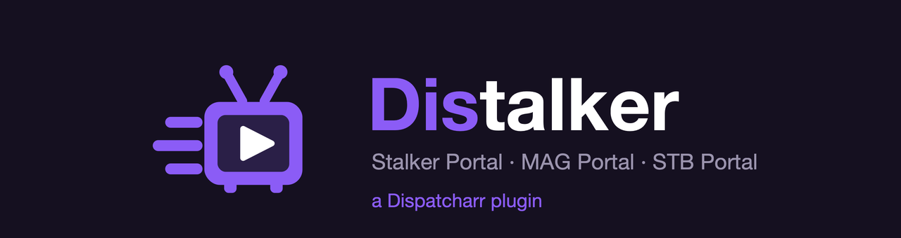

<h1 align="center">
  
</h1>

**Stalker / MAG portal support for [Dispatcharr](https://github.com/Dispatcharr/Dispatcharr), as a plugin.**

> *"Get out of here, Stalker."*

Distalker connects Dispatcharr directly to Stalker IPTV portals. No sidecar
container, no proxy process, and **no published port per portal** — everything
happens inside Dispatcharr itself.

> ⚠️ **Experimental.** Version 0.x. Interfaces and settings may change without
> notice. Not yet submitted to the official plugin registry.

---

## Why

The usual way to feed Dispatcharr from a Stalker portal is to run a separate HLS
proxy alongside it and point Dispatcharr at that. It works, but it means another
container to run and one published port for every portal you own.

Distalker removes both. Portal channels arrive as an ordinary M3U account, and
stream links are resolved on the fly at tune time.

## How it works

**Sync**, when you press it, logs into each portal, downloads its channel list,
and writes it as a plain `.m3u` file backed by a **file-backed M3U account**.
From there a portal is an M3U account like any other: the Accounts, Groups and
Live pages do the grouping and filtering, and Distalker implements none of its
own.

**Resolve**, at every tune, asks the portal for a fresh link. Stalker links
expire within seconds, so they cannot be baked into a playlist. Each channel's
URL in the generated file is a placeholder that nothing ever fetches:

```
http://distalker.invalid/<portal-slug>/<base64-cmd>
```

A stream profile named `Distalker` hands that placeholder to a small resolver,
which asks the portal for a real link and becomes `ffmpeg`. Dispatcharr treats
the result like any other command profile — buffering, multi-client sharing and
stats all work normally.

```
  sync ──> portal ──> /data/uploads/m3us/distalker-<slug>.m3u ──> M3U account
  tune ──> resolver ──> create_link ──> ffmpeg ──> MPEG-TS
```

### What it writes, and where

A plugin that writes credentials to disk should say so plainly:

| Path | Contents |
| --- | --- |
| `/data/uploads/m3us/distalker-<slug>.m3u` | The generated playlist |
| `/data/distalker/portals.txt` | Your portal list verbatim, **credentials included** |
| `/data/distalker/state/*.json` | What the resolver reads at tune time, **credentials included**, `0600` |
| Redis `distalker:*` | The same, plus the session token |

The copies exist because the resolver runs per tune with no database access, and
because Dispatcharr's Redis is a cache that comes back empty from every restart
— without them, nothing would play until you pressed Sync again.

Nothing is written inside the plugin directory, so re-importing a build never
takes your list with it. Nothing leaves the machine: no telemetry, no update
check, and the only host Distalker contacts is your portal.

## Requirements

- Dispatcharr with the plugin system (`/data/plugins`)
- `ffmpeg` in the Dispatcharr container (it always is)
- A Stalker portal and a MAC address authorised on it

No extra Python packages: `requests` and `redis` ship with Dispatcharr.

## Installation

Download `distalker-<version>.zip` from the
[Releases](https://github.com/PiloUnk/distalker/releases) page, then:

1. In Dispatcharr, go to *Settings → Plugins* and use **Import Plugin** — drag
   the ZIP in, no unpacking required.
2. **Enable** Distalker once it appears.
3. **Restart Dispatcharr.**

Nothing is bind-mounted, and no port is published.

> **Step 3 applies to every update too.** Dispatcharr can reload a plugin
> without a restart, but only lazily and only in the process that notices —
> and the container runs several workers, each with its own copy. A channel
> created through a worker still running the old code, or none at all, silently
> misses its stream profile. Restarting puts them all on the same version at
> once.

**Updating** — re-importing a newer ZIP prompts before replacing. Settings live
in the database and survive it. **Do not uninstall first:** deleting a plugin
takes your portals, credentials and every other setting with it. Only your
portal list would survive, from `/data/distalker/portals.txt`.

What changed between versions is in [CHANGELOG.md](CHANGELOG.md), and in the
notes on each [release](https://github.com/PiloUnk/distalker/releases).

Building the ZIP yourself, and running from source, are in
[CONTRIBUTING.md](CONTRIBUTING.md).

## Configuration

Everything is in Dispatcharr's own UI: **Settings → Plugins → Distalker**. Two
tabs — *Settings* holds the boxes, *Actions* holds the buttons that read them.
There is no separate web interface and no config file.

Pressing a button saves the panel first, so **Save** is never a prerequisite.
The panel cannot refresh itself, though: to read what an action reported, press
the refresh icon at the top of the Plugins page.

### The portal list

One box matters. Write a line per portal:

```
http://portal.example.com:8080/c/ | 00:1A:79:AA:BB:CC
http://other.example.com/c/       | 00:1A:79:DD:EE:FF | username=joe password=secret
```

Then press **Sync**. The list *is* the configuration, so it can be edited in
bulk, pasted between installs, or kept under version control.

**The name is optional** — it is a label, read from the host by default, so
`http://myportal.example:2095/c/` becomes `myportal`. Put one in front when
you want something else:

```
Living Room | http://portal.example.com/c/ | 00:1A:79:AA:BB:CC
```

You will also be asked for one if two lines resolve to the same host — two
subscriptions with the same provider, typically. Distalker will not invent a
suffix, because that name identifies the portal in every one of its channel
URLs; the sync says which lines collide and stops until you name one.

**A commented line is a suspended portal.** `#` at the start and it stops
resolving on the next sync, while its M3U account, streams and channels stay
exactly where they are. Uncomment it to bring it back.

MAC addresses are accepted in the shapes providers quote them —
`00:1A:79:AA:BB:CC`, `00-1a-79-aa-bb-cc`, or twelve bare hex digits. So is the
URL:

| You enter | Distalker uses |
| --- | --- |
| `http://host:8080/c/` | `http://host:8080/c/portal.php` |
| `host:8080/c/` | `http://host:8080/c/portal.php` |
| `http://host` | `http://host/portal.php` |
| `http://host/…/load.php` | unchanged — explicit endpoints are preserved |
| `http://host/c/other.php` | `http://host/c/portal.php` |

Anything unusual goes in trailing `key=value` pairs, separated by spaces or
further `|` characters, quoted where a value contains spaces
(`password="two words"`):

| Key | Purpose | Default |
| --- | --- | --- |
| `username` | Portal login, if your provider issued one | — |
| `password` | Portal password | — |
| `max_streams` | Concurrent connections allowed for this MAC | `1` |
| *STB keys* | `model`, `serial`, `device_id`, `device_id2`, `signature`, `timezone` — see below | MAG254 |

> **`max_streams` cannot be detected.** Portals do not tell the box what the
> account is allowed, so the default is **1**, which is what most of them sell.
> Raise it only on what your provider told you: exceeding it is the quickest
> route to a blocked MAC.

> **Credentials are visible in this box**, and stored unencrypted in the
> Dispatcharr database like every plugin setting. Treat your backups
> accordingly.

### STB identity

Distalker presents itself to portals as a MAG set-top box, and **each portal
carries its own identity** — a different provider may expect a different box.
Write none of these and it behaves as a stock MAG254:

```
http://portal.example.com/c/ | 00:1A:79:AA:BB:CC | model=MAG322 timezone=Europe/Paris
```

| Line key | Default | Notes |
| --- | --- | --- |
| `model` | `MAG254` | Sent as the `X-User-Agent` device model. Also `MAG250`, `MAG322`, … |
| `serial` | `0000000000000` | Portal cookie `sn`. |
| `device_id` | 64 × `f` | Sent during device-ID authentication. |
| `device_id2` | same as `device_id` | Most boxes carry the same value in both slots. |
| `signature` | 64 × `f` | Accepted, but **currently unused**: no request Distalker makes includes it. |
| `timezone` | `UTC` | Portal cookie `timezone`, e.g. `Europe/Paris`. |

> **These are the untested part of this plugin.** Every portal it has run
> against authenticates on the URL and the MAC alone, so the defaults are the
> only combination with real mileage. If a portal needs these and Distalker
> gets it wrong, that is a bug worth reporting with the values your provider
> gave you.

Which authentication runs is decided by one thing — whether you supplied
credentials. With a username *and* password: handshake, then `do_auth`. Without:
handshake, then a device-ID step. A failed device-ID step is **not fatal**, as
plenty of portals authorise on the MAC alone; if the session really is
unauthorised, the channel fetch says so straight after, and far more clearly.

### Other settings

You should not need any of these.

| Field | Default | Purpose |
| --- | --- | --- |
| ffmpeg arguments | a plain remux, plus the MAG headers and `-rw_timeout` | Placeholders `{url}`, `{ua}`, `{referer}`, `{headers}`. Must write MPEG-TS to `pipe:1`. **Do not add `-reconnect`** — it retries a link that has already expired, and stops Dispatcharr failing over to the channel's other sources. |
| Fallback stream profile | `ffmpeg` | Plays the *other* sources on a Distalker channel — see below. |
| Portal request timeout | `60` s | Every portal request, sync and tune alike. Raise it if a busy portal times out assembling its channel list. |
| Auto-assign stream profile | on | Gives a channel the Distalker profile as it gains a portal stream, after each M3U refresh, and once more after any channel fails to start. |

### Channels that mix a portal with another provider

Dispatcharr resolves the stream profile from the **channel**, never from the
source it is about to play. So once a channel carries the Distalker profile,
*every* source on it goes through this plugin — including sources from other
providers, which it hands to the **fallback stream profile**.

Name any command profile there: `ffmpeg`, `streamlink`, `VLC`, or one of your
own. `Proxy` and `Redirect` cannot be used, because Dispatcharr implements those
internally rather than as a command; naming one falls back to a plain ffmpeg
remux and says so in the sync message.

**What this costs:** on a mixed channel, the non-portal sources go through an
ffmpeg remux instead of Dispatcharr's direct relay. Channels without the
Distalker profile are untouched, and channels whose sources are all portal ones
lose nothing. If every source on a channel comes from a portal, none of this
applies to you.

> **Do not set `Distalker` as your global Default Stream Profile.** It would
> appear to work and spare you assigning anything, but every channel in the
> install — including those with no portal source — would spawn a Python
> process per tune, Dispatcharr would stop rescuing HLS, RTSP and UDP streams
> the way it does under `Proxy`, and disabling or re-importing this plugin
> would stop *all* your channels tuning rather than only the portal ones.

## Usage

Four actions, and normally you press one:

| Action | What it does |
| --- | --- |
| **1. Test** | Authenticates against every listed portal and reports its group count. Answers straight away; changes nothing. Optional — but the cheap way to learn a MAC is wrong. |
| **2. Sync** | Applies the list and fetches **only what changed**. Runs in the background. |
| **Re-fetch all** | Downloads every portal's line-up again, changed or not. For when a provider's line-up moved rather than your list. |
| **Assign** | Points Distalker channels at the Distalker stream profile. Runs by itself after each M3U refresh and after any channel fails to start, so it is a repair button, not a step. |

First run: write your portal line → **Test** → **Sync** → create your channels
in Dispatcharr from the streams that appear. From then on **Sync** is the only
button you should need.

### Sync only fetches what changed

A line-up is one request per portal that a busy provider can take minutes to
assemble, so re-downloading portals that did not change is time spent for
nothing:

| Your line | What Sync does |
| --- | --- |
| new | logs in, downloads, creates its M3U account |
| edited in a way that changes the line-up (URL, MAC, credentials, STB identity) | downloads it again |
| edited in a way that cannot (`max_streams`, the advanced settings) | nothing |
| unchanged | nothing |
| deleted, or commented out with `#` | stops resolving; **its M3U account, streams and channels are left alone** |

Use **Re-fetch all** when the provider changed the line-up rather than you
changing the list. A portal's channels do drift over months — that is what the
second button is for. There is no scheduled sync: Dispatcharr cannot run a
plugin's background task on a stock install, so pretending otherwise would only
mean a schedule that never fires.

**Sync does not answer the click.** A plugin action runs on the request thread,
so anything slower than the proxy in front of Dispatcharr returns a 504. The
button hands the work to the background and returns; **you get a notification
when it finishes**, and the result also lands in *Last action*. Pressing Sync
again while one is running is refused — most portals allow a single connection
per MAC, and two syncs would spend it on each other.

**A new portal stops at Pending Setup.** That is Dispatcharr's flow for any M3U
account, not something this plugin can skip: choose its groups in *M3U Accounts*
and its channels appear.

### What Last action says

It holds the state of every portal, because it is read long after the click that
filled it:

```
myportal: 1240 channels, expires 18 Aug 2027 (just fetched) | backup: 812 channels, expires 08 Apr 2027
```

The expiry comes from the portal itself — resellers write the subscription end
date in the account's phone field, which the MAG interface displays — and
Distalker also writes it to the M3U account, where Dispatcharr shows expiry
dates natively. If the portal reports the account as blocked, the line says so
in capitals: a blocked account otherwise looks exactly like an empty channel
list.

## Limitations

- **Live TV only.** No VOD, no series.
- **No EPG yet.** Generated `tvg-id`s are stable (`<slug>.<channel-id>`), so EPG
  can be added later without disturbing existing streams.
- **Credentials are stored unencrypted**, in the Dispatcharr database and on
  disk — see [What it writes, and where](#what-it-writes-and-where).
- **No session keep-alive.** A cached token is reused and re-issued on demand.
  Portals that drop idle sessions are untested.
- **One `ffmpeg` per tuned channel**, which is normal for any non-proxy stream
  profile in Dispatcharr.

## Troubleshooting

A channel that will not start fails in one of two shapes, and one line of the
log tells them apart:

| In the log | What it means |
| --- | --- |
| `HTTP reader connecting to http://distalker.invalid/…`, then `Failed to resolve 'distalker.invalid'` | The channel is **not** using the Distalker profile, so the resolver never ran. The failure itself triggers a repair — try once more. |
| `Server closed connection`, possibly with `Error reading stderr … Bad file descriptor` | The resolver **ran and exited**. Its reason is on its stderr, which Dispatcharr sometimes loses; run it by hand (below). |

Resolver output otherwise appears in the channel's log, prefixed `[distalker]`:

| Message | Meaning |
| --- | --- |
| `portal '<slug>' is unknown to both Redis and /data/distalker/state` | That portal has never been synced on this install, or was renamed. Press **Sync**. |
| `cannot reach Redis (…); reading the mirrored portal instead` | Informational — playback carried on from the copy on disk. |
| `cached session rejected` | Normal. The token expired and is being renewed. |
| `create_link returned an empty command` | The portal refused the channel — often a connection limit or an expired subscription. |
| `portal returned an empty channel list` | Wrong MAC address or portal URL. |
| ffmpeg: `Server returned 5XX Server Error reply` | The portal issued a link but refused to serve it. Probe it (below) — usually a connection limit. |

**Nothing plays and you see 503 / "max connections".** Every viewer, preview,
recording and Plex client counts against the same `max_streams`. A preview left
open in a browser tab holds it until you close it.

### Running the resolver by hand

The way to see a message Dispatcharr dropped. Take the `distalker.invalid` URL
from the log:

```bash
docker exec -i dispatcharr /dispatcharrpy/bin/python \
  /data/plugins/distalker/resolver.py \
  'http://distalker.invalid/<slug>/<b64cmd>' 'Mozilla/5.0' > /dev/null
```

`stdout` is the stream, hence `> /dev/null`; the diagnostics are on `stderr`. It
spends a connection on the portal, so stop anything else that is playing.

`--probe` before the URL resolves a link and prints what the provider answered
without playing it — which is how you read the real reason behind ffmpeg's
`Server returned 5XX`, usually a connection limit, an expired subscription or a
blocked MAC.

> **Still running another proxy against the same MAC?** It will hold the
> portal's connection, and every Distalker tune gets refused. Stop it first.

## Contributing

How the plugin is built, and the Dispatcharr behaviours that shape it, are in
[CONTRIBUTING.md](CONTRIBUTING.md).

## Credits

Built for [Dispatcharr](https://github.com/Dispatcharr/Dispatcharr).

Prior-art attribution for the Stalker protocol implementation is recorded in
[LICENSE](LICENSE).

## Licence

MIT — see [LICENSE](LICENSE).
